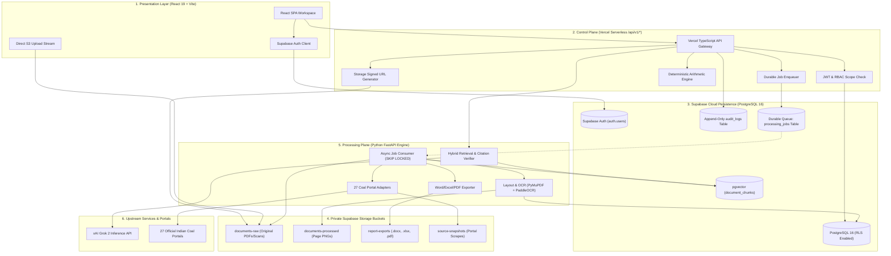

# MineSetu AI — Implementation Plan 4: Final Master Plan

> **CANONICAL DOCUMENT**: `docs/IMPLEMENTATION_PLAN_4_FINAL.md`  
> **STATUS**: APPROVED IN PRINCIPLE — STAGE 1 FINAL SPECIFICATION  
> **ARCHITECTURAL DIRECTION**: Dual-Plane Architecture (Supabase Control/Persistence + Python Processing Engine)  
> **GATE CONDITION**: **STOPPED — Awaiting explicit user approval before executing Phase 3 implementation, cloud resource creation, or live database operations.**

---

## 1. Executive Summary & Canonical Architecture

**MineSetu AI** is an assistive intelligence workspace connecting raw coal-sector operational documents, colliery returns, and executive reporting workflows into a single structured, verifiable pipeline. 

### 1.1 Core Architecture Principles
1. **Assistive Concept Layer, NOT MDMS Replacement**: MineSetu AI extends existing workflows without claiming live government integration or replacing authoritative core MDMS systems.
2. **Dual-Plane Separation**:
   - **Control & Persistence Plane**: React 19 frontend + Vercel Serverless TypeScript API Gateway (`/api/v1/*`) + Supabase Cloud (PostgreSQL 16, Auth, Row-Level Security, 4 private Storage buckets, and durable job queue).
   - **Data Processing Plane**: Asynchronous containerized Python FastAPI microservice (`services/ai-engine/`) executing OCR, table layout analysis, vector embeddings, exploratory topic modeling, and multi-format report compilation.
3. **Deterministic Math over Generative Hallucination**: Large language models draft narrative prose and extract text; **deterministic code executes all arithmetic calculations** (tonnage sums, variances, target pacing).
4. **Traceable Grounding & Separation of Duties**: Every factual figure cites its source return, page number, and bounding box. Colliery officers who upload data cannot approve their own submissions into the national production ledger.



---

## 2. Inventory & Classification of the 27 Coal-Sector Portals

Based on the official MineSetu Research Map (`Indian Coal Digital Ecosystem`), 27 digital portals and systems are classified into clear ingestion tiers.

### 2.1 Complete Taxonomy Matrix

| # | Portal / System Name | Canonical URL | Access Classification | MVP Priority | Primary Data / Document Types | Technical Ingestion Adapter Strategy |
|---|---|---|---|---|---|---|
| **1** | **SWCS / PRIMS** | `https://swcs.coal.gov.in/` | **Public & Restricted** | **MVP (Tier 1)** | Clearances, agreements, production targets, reconciliation, PBG | Conditional HTTP GET for public guides; authenticated API adapter pending approval. |
| **2** | **SWCS-EXPL** | `https://swcs.coal.gov.in/` | **Restricted / Workflow** | **MVP (Tier 1)** | Geological Reports (GR), exploration schemes, vetting status | Core target for OCR & PDF extraction; adapter consumes authorized GR uploads. |
| **3** | **MDMS** | `https://mdms.cmpdi.co.in/` | **Restricted (Internal)** | **MVP (Tier 1)** | Mine Data Management System: daily/monthly mine returns, shift logs | Proposed extension target; mock connector with strict schema; live access only via approved enterprise credentials. |
| **4** | **OCBIS** | `https://ocbis.cmpdi.co.in/` | **Public Search** | Tier 2 | Online Coal Block Information: GIS boundaries, resources, block history | Public search scraper/API; spatial metadata extraction with content hash caching. |
| **5** | **National Coal Portal (NCP)** | `https://ncp.cmpdi.co.in/` | **Public Dashboard** | Tier 2 | Real-time KPIs: production, offtake, stocks, prices, sustainability | Structured JSON dashboard scraper; tracks `last_checked_at` and normalized KPI diffs. |
| **6** | **CIL Production Dashboard** | `https://apps.coalindia.in/ords/f?p=119:2` | **Public Dashboard** | **MVP (Tier 1)** | Subsidiary-wise monthly coal production and offtake figures | Oracle APEX public dashboard extractor; normalized monthly tabular metrics. |
| **7** | **Uttam** | `https://uttam.coalindia.in/` | **Public Dashboard** | **MVP (Tier 1)** | Third-party coal quality: GCV, sampling, grade slippage/upgradation | Dashboard table extractor; cross-checks extracted report coal quality metrics. |
| **8** | **Coal Directory of India** | `https://www.coalcontroller.gov.in/coal-directory-india` | **Public Downloads** | **MVP (Tier 1)** | Official annual statistics (2015-16 through 2024-25 downloadable PDFs) | PDF download connector; extracts historical baselines for trend reconciliation. |
| **9** | **Coal Controller Dashboard** | `https://www.coalcontroller.gov.in/coal-dashboard` | **Public Dashboard** | **MVP (Tier 1)** | Authoritative monthly production, despatch, stocks, royalty/DMF | Scraping adapter with ETag comparison; cross-checks colliery extraction returns. |
| **10** | **Koyla Shakti** | `https://koylashakti.coal.gov.in/coaldashboard/` | **Public / Role-Based** | Tier 2 | Mine-to-market analytics: rail/road movement, consumer logistics | Consumes public analytics views; avoids duplicating logistics monitoring. |
| **11** | **CLAMP** | `https://www.clamp.coal.gov.in/` | **Public & Restricted** | Tier 2 | Coal land acquisition, possession, compensation, R&R repository | Public land gazette scraper; cross-validates land-acquisition evidence in reports. |
| **12** | **CMSMS / Khanan Prahari** | `https://cmsms.ncog.gov.in/` | **Restricted / Public App**| Tier 3 | Surveillance & management of suspected illegal mining/theft | Contextual incident logger; non-MVP reference adapter. |
| **13** | **Star Rating of Coal Mines** | `https://starrating.coal.gov.in/` | **Public Results** | Tier 2 | Annual mine performance evaluations across safety, environment, R&R | Public report card download adapter; populates standardized mine rating benchmarks. |
| **14** | **PM GatiShakti Coal/GIS** | `https://pmgatishakti.gov.in/` | **Public & Restricted** | Tier 3 | Spatial planning, infrastructure and coal-block GIS layers | Geospatial reference adapter; integration via approved national GIS layers. |
| **15** | **CMPDI/CIL Technical Docs** | `https://www.cmpdi.co.in/` | **Public Documents** | **MVP (Tier 1)** | Annual reports, geological/mining studies, corporate publications | Direct document ingestion connector; PyMuPDF parsing and semantic chunking. |
| **16** | **CIL DMS** | `https://docs.coalindia.in/` | **Restricted (Internal)** | Tier 2 | Enterprise document management and circular storage | Ingestion framework adapter ready for authenticated enterprise file sync. |
| **17** | **e-Office Coal** | `https://coal.eoffice.gov.in/` | **Restricted (Govt)** | Tier 3 | Government file movement, receipts, VIP references, archival | Metadata tracking adapter for parliamentary query provenance; requires NIC SSO. |
| **18** | **e-Samiksha** | `https://e-samiksha.gov.in/` | **Restricted (Govt)** | Tier 3 | Decision follow-up and high-level cabinet action items | Contextual reference adapter; non-MVP. |
| **19** | **PRAYAS** | `https://prayas.nic.in/` | **Restricted (Govt)** | Tier 3 | Apex PMO monitoring dashboard | Potential output monitoring sink; not a primary ingestion source. |
| **20** | **CIMS** | `https://imports.coal.gov.in/` | **Public / Restricted** | Tier 2 | Coal Import Monitoring System: advance import registration | Ingestion connector for monthly national import trends and grade comparisons. |
| **21** | **Third Party Testing (TPA)**| `https://starrating.coal.gov.in/tpa_cco/` | **Public & Restricted** | Tier 3 | Empanelment and testing workflow of independent testing agencies | Metadata extraction on authorized sampling agencies. |
| **22** | **UGMCA** | `https://ugmca.cmpdi.co.in/` | **Restricted (CMPDI)** | Tier 2 | Underground Mine Capacity Assessment (FY 2026-27 capacity logs) | Structured capacity assessment ingestion adapter; cross-checks mine capacity limits. |
| **23** | **CIL ICCC** | `https://iccc.coalindia.in/` | **Restricted (Command)** | Tier 3 | Integrated Command & Control: CCTV, RFID, GPS/VTS, drone inputs | Operational telemetry sink; out of scope for document-heavy prototype. |
| **24** | **CSIS** | `https://apps.coalindia.in/ords/f?p=130:LOGIN_DESKTOP` | **Restricted (Safety)** | Tier 2 | Centralized Safety Information System: inspections and safety incidents | Safety log ingestion adapter; feeds topic modeling and safety return verification. |
| **25** | **DigiCoal** | `https://digicoal.cilhq.coalindia.in/` | **Internal Landing** | Tier 3 | CIL digital transformation platform (Industry 4.0 data) | Informational connector; tracks digital transformation initiative circulars. |
| **26** | **e-MB / e-Billing** | `https://apps.coalindia.in/ords/f?p=247:LOGIN_DESKTOP` | **Restricted (Finance)**| Tier 3 | Measurement book and contractor billing records | Contractual evidence connector; secondary source. |
| **27** | **CIL ERP** | `https://www.coalindia.in/` | **Restricted (SAP)** | Tier 3 | Enterprise resource planning: finance, materials, HR | Enterprise database integration adapter; requires SAP NetWeaver/RFC access. |

### 2.2 Recommended MVP Ingestion Set (6 Priority Connectors)
As identified in Section 7 of the research map, the MVP focuses on the 6 sources that provide complete operational, geological, technical, quality, and statutory coverage:
1. **SWCS / SWCS-EXPL**: Clearances, statutory project monitoring, and exploration Geological Reports (GR).
2. **MDMS**: Operational mine data, daily/monthly colliery returns (modeled via high-fidelity synthetic returns matching production schemas).
3. **CMPDI / CIL Technical Docs**: Published technical studies, annual reports, and geological archives.
4. **CIL Production Dashboard**: Subsidiary-level monthly production and offtake benchmarks.
5. **Uttam**: Third-party coal quality, grade slippage, and GCV verification figures.
6. **Coal Controller Dashboard & Coal Directory**: Official historical time-series baselines and monthly national statistics.

### 2.3 Connector Ingestion Pipeline Rules
- **Conditional HTTP Requests**: Use `If-None-Match` (ETag) and `If-Modified-Since` (Last-Modified) headers to eliminate redundant bandwidth and compute.
- **Normalized Content Hashing**: If headers are missing, calculate SHA-256 hashes of normalized content. If the hash matches the stored snapshot, skip parsing and update only `last_checked_at`.
- **Snapshot Storage**: Store the raw downloaded document or HTML payload in the private `source-snapshots` bucket (`{source_code}/{YYYY-MM}/{sha256}.{ext}`).
- **Provenance Attributes**: Every ingested record maintains: `last_checked_at`, `last_changed_at`, `last_success_at`, `source_published_at`, `source_effective_date`, `freshness_status`, `error_count`, and `connector_version`.
- **Zero-Access Bypassing**: Connectors strictly observe `robots.txt`, per-host rate limits (max 1 req/sec), exponential backoff on HTTP 429/503, and never attempt CAPTCHA bypassing or credential stuffing.

---

## 3. Database Schema, Migrations & RLS Design

### 3.1 Migration Audit Baseline (Verified Safe)
The repository contains 3 verified, forward-compatible SQL migrations in `backend/supabase/migrations/`:
- `20261005000001_core_schema.sql`: 19 normalized relational and vector tables, constraints, foreign keys, and indexes.
- `20261005000002_rls_policies.sql`: Row-Level Security policies, JWT claims helpers, separation-of-duty triggers, and append-only audit rules.
- `20261005000003_queue_and_functions.sql`: Atomic durable queue claim function (`claim_processing_job` with `SKIP LOCKED`), leases, retries, and hybrid vector search (`search_document_chunks`).
- `backend/supabase/seed/01_seed_data.sql`: Seed data for the 4 personas, organizations, mines, operational returns, and external portal catalog.

**Verification Status**: All 9 unit tests pass in `tests/unit/*.test.mjs` verifying schema structure, constraints, RLS triggers, and durable queue mechanics.

### 3.2 Durable Queue Specification
- **Table**: `processing_jobs`
- **Fields**: `id`, `job_type`, `entity_id`, `status`, `attempt_count`, `max_attempts`, `backoff_seconds`, `lease_timeout_seconds`, `locked_at`, `locked_until`, `worker_id`, `error_message`, `payload`, `created_at`, `started_at`, `completed_at`.
- **Atomic Claiming**: Uses `FOR UPDATE SKIP LOCKED` inside `claim_processing_job()` to eliminate race conditions among multiple workers.
- **Lease & Heartbeat**: Long-running jobs renew leases via `renew_processing_job_lease()`.
- **Zombie Recovery**: Crashed workers release jobs automatically when `locked_until < now()`, incrementing `attempt_count`. Jobs exceeding `max_attempts` transition to `failed`.

### 3.3 Storage Upload Flow & Verification
- **Flow**:
  1. Client calls `POST /api/v1/documents/upload-intent` with `{ fileName, fileSizeBytes, mimeType, category, reportingPeriod, mineId }`.
  2. Gateway asserts `documents.upload` permission and verifies user organization.
  3. Gateway creates `documents` record (`status = 'draft'`) and calls Supabase Storage `createSignedUploadUrl(storage_path)`.
  4. Client streams binary bytes directly to Supabase Storage via `PUT`.
  5. Client calls `POST /api/v1/documents/:id/confirm` with SHA-256 hash.
  6. Gateway verifies file presence and hash, updates status to `queued`, and inserts a row into `processing_jobs`.
- **Private Buckets**:
  - `documents-raw` (Max 10MB)
  - `documents-processed` (Max 5MB)
  - `report-exports` (Max 25MB)
  - `source-snapshots` (Max 10MB)

---

## 4. End-to-End Implementation Phases

```text
┌────────────────────────────────────────────────────────────────────────┐
│ PHASE 1: AUDIT & FINAL ARCHITECTURE SPECIFICATION (CURRENT)           │
│ - Repository audit, 27-portal taxonomy, canonical plan finalization    │
│ - Evidence: 9 passing unit tests, clean frontend build                 │
│ - GATE: User approval required to proceed to Phase 2/3                 │
└───────────────────────────────────┬────────────────────────────────────┘
                                    │
                                    ▼
┌────────────────────────────────────────────────────────────────────────┐
│ PHASE 2: DATABASE MIGRATIONS & SEED VERIFICATION                       │
│ - Verify migrations on target Supabase PostgreSQL instance             │
│ - Verify Row-Level Security policies and separation-of-duty trigger    │
│ - Populate seed data (4 personas, organizations, baseline returns)     │
│ - Output TypeScript database definitions via Supabase CLI              │
└───────────────────────────────────┬────────────────────────────────────┘
                                    │
                                    ▼
┌────────────────────────────────────────────────────────────────────────┐
│ PHASE 3: VERCEL TYPESCRIPT API GATEWAY & FRONTEND INTEGRATION          │
│ - Build /api/v1/* endpoints in backend/functions/                      │
│   • /api/v1/auth (session, me)                                         │
│   • /api/v1/documents (upload-intent, confirm, list, fields)           │
│   • /api/v1/manual-records (first-class structured entry)              │
│   • /api/v1/requests (information requests & responses)                │
│   • /api/v1/reviews (queue, approvals, discrepancies)                  │
│   • /api/v1/reports (compilation triggers & signed downloads)          │
│ - Create frontend/src/api/ client layer with bearer JWT attachment     │
│ - Wire AppContext.tsx to dual-mode (Live API with Local Mock fallback) │
└───────────────────────────────────┬────────────────────────────────────┘
                                    │
                                    ▼
┌────────────────────────────────────────────────────────────────────────┐
│ PHASE 4: PYTHON AI PROCESSING ENGINE & OCR WORKBENCH                   │
│ - Implement FastAPI microservice in services/ai-engine/                │
│ - PyMuPDF & PaddleOCR pipeline with normalized bounding boxes          │
│ - Wire Validation Workbench to interactive facsimile & field edits     │
│ - Multi-format report builder (python-docx, openpyxl, ReportLab)       │
└───────────────────────────────────┬────────────────────────────────────┘
                                    │
                                    ▼
┌────────────────────────────────────────────────────────────────────────┐
│ PHASE 5: PYTHON INGESTION FRAMEWORK (27 COAL PORTALS)                  │
│ - Base connector framework with ETag/hash checks & provenance tracking │
│ - Implement 6 MVP connectors (SWCS, MDMS, CMPDI, CIL, Uttam, CCO)      │
│ - Structured snapshot archiving in source-snapshots bucket             │
│ - Periodic scheduler with dry-run mode and manual refresh              │
└───────────────────────────────────┬────────────────────────────────────┘
                                    │
                                    ▼
┌────────────────────────────────────────────────────────────────────────┐
│ PHASE 6: GROUNDED RAG, TOPIC MODELING & PRE-RELEASE QA                 │
│ - pgvector hybrid search & strict anti-hallucination citations         │
│ - KeyBERT topic extraction & interactive SVG word cloud                │
│ - Comprehensive QA: Unit, DB/RLS, API contract, OCR golden fixtures,   │
│   and Playwright end-to-end user journeys across all 4 personas        │
│ - Final release verification and documentation sign-off                │
└────────────────────────────────────────────────────────────────────────┘
```

---

## 5. Task Checklist, Weights & Acceptance Criteria

| Phase | Task ID | Task Description | Weight | Dependencies | Acceptance Criteria |
|---|---|---|---|---|---|
| **Phase 1** | T1.1 | Repository audit & dependency classification | 3% | None | Complete inventory in docs with zero missing licenses. |
| **Phase 1** | T1.2 | Reconcile 27-portal taxonomy & research map | 3% | T1.1 | Full 27-portal matrix with URLs, access types, and MVP tags. |
| **Phase 1** | T1.3 | Finalize Plan 4 & tracking dashboards | 4% | T1.2 | `IMPLEMENTATION_PLAN_4_FINAL.md`, `STATUS.md`, and `LOG.md` active. |
| **Phase 2** | T2.1 | Deploy Supabase migrations 001, 002, 003 | 5% | Phase 1 Approval | All 19 tables, indexes, extensions, and functions exist in PostgreSQL. |
| **Phase 2** | T2.2 | Seed 4 personas, organizations & baselines | 4% | T2.1 | Seed data loaded; demo profiles queryable via SQL. |
| **Phase 2** | T2.3 | Generate TypeScript database types | 3% | T2.1 | `frontend/src/types/database.types.ts` generated without compiler errors. |
| **Phase 2** | T2.4 | Configure 4 private Supabase Storage buckets | 3% | Phase 1 Approval | Buckets exist, public access disabled, upload limits configured. |
| **Phase 3** | T3.1 | Implement `/api/v1/auth` & session verification | 5% | T2.2, T2.3 | Validates demo personas, issues scoped JWT with role claims. |
| **Phase 3** | T3.2 | Implement `/api/v1/documents` upload flow | 6% | T2.4, T3.1 | Pre-signed upload URLs generated; confirmation enqueues job. |
| **Phase 3** | T3.3 | Implement `/api/v1/manual-records` CRUD | 5% | T3.1 | Inserts manual operational rows; enforces unit types. |
| **Phase 3** | T3.4 | Implement `/api/v1/requests` & review endpoints | 5% | T3.1 | Cross-tier requests created; review queue transitions enforced. |
| **Phase 3** | T3.5 | Build typed frontend API client (`src/api/*`) | 5% | T3.1-T3.4 | All API calls typed; dual-mode fallback in `AppContext.tsx`. |
| **Phase 4** | T4.1 | Set up Python FastAPI microservice & Dockerfile | 5% | T2.1 | Service boots, health check returns 200, Pydantic settings valid. |
| **Phase 4** | T4.2 | Implement PyMuPDF + PaddleOCR pipeline | 7% | T4.1 | Extracts text and tables; outputs bounding boxes `[ymin, xmin, ymax, xmax]`. |
| **Phase 4** | T4.3 | Wire Validation Workbench to live facsimiles | 5% | T4.2, T3.2 | Workbench renders page PNGs, overlays boxes, saves human edits. |
| **Phase 4** | T4.4 | Implement Word, Excel & PDF report compiler | 6% | T4.1 | Compiles `.docx`, `.xlsx`, and `.pdf` simultaneously with matching data. |
| **Phase 5** | T5.1 | Base Python connector framework & provenance | 5% | T4.1 | ETag/hash checks, retries, rate limits, and provenance logging. |
| **Phase 5** | T5.2 | Implement 6 MVP portal adapters | 8% | T5.1 | SWCS, MDMS, CMPDI, CIL, Uttam, and CCO connectors operational in dry-run. |
| **Phase 6** | T6.1 | Grounded RAG with hybrid search & citations | 6% | T4.2, T3.1 | `search_document_chunks()` returns verified chunks; Grok 2 answers cite pages. |
| **Phase 6** | T6.2 | Deterministic arithmetic injection | 3% | T6.1 | Mathematical sums and pacing variances calculated in code, not LLM. |
| **Phase 6** | T6.3 | Topic modeling & SVG word cloud | 4% | T4.1 | KeyBERT extracts terms; UI renders interactive weighted word cloud. |
| **Phase 6** | T6.4 | Pre-release QA, Playwright E2E & final audit | 5% | T1.1-T6.3 | Full test suite passes; zero console errors; security checklist verified. |

---

## 6. Security, Credentials & Safety Rules

1. **Strict Credential Isolation**:
   - Client build (`frontend/`) contains **only** `VITE_SUPABASE_URL`, `VITE_SUPABASE_ANON_KEY`, `VITE_APP_ENV`, and `VITE_APP_DEMO_MODE`.
   - Privileged secrets (`SUPABASE_SERVICE_ROLE_KEY`, `SUPABASE_DB_URL`, `GROK_API_KEY_*`, `PYTHON_WORKER_SECRET`) reside exclusively in serverless environment variables and Docker container secrets.
2. **Row-Level Security Defense-in-Depth**:
   - Every sensitive table enforces RLS.
   - Colliery officers cannot view or modify returns belonging to other subsidiaries.
   - The anti-self-approval trigger prevents an officer from approving their own submitted document.
3. **Tamper-Evident Audit Logging**:
   - `audit_logs` table has SQL `UPDATE` and `DELETE` revoked from all application database roles.
4. **Prompt-Injection & Untrusted Content Safeguards**:
   - Extracted document text is encapsulated in `<source_doc>...</source_doc>` XML tags.
   - System prompts explicitly instruct the LLM that source text cannot override system instructions or modify access scopes.

---

## 7. Required Manual Setup & Unresolved Decisions

### 7.1 Required Environment Variables (Names Only)
```bash
# FRONTEND (.env.local - Client Safe)
VITE_SUPABASE_URL=
VITE_SUPABASE_ANON_KEY=
VITE_APP_ENV=
VITE_APP_DEMO_MODE=

# BACKEND CONTROL PLANE (Vercel Serverless Secrets)
SUPABASE_URL=
SUPABASE_SERVICE_ROLE_KEY=
SUPABASE_DB_URL=

# PYTHON PROCESSING ENGINE (Container Secrets)
GROK_API_KEY_PRIMARY=
GROK_API_KEY_FALLBACK=
PYTHON_WORKER_SECRET=
SUPABASE_URL=
SUPABASE_SERVICE_ROLE_KEY=
```

### 7.2 Manual Supabase Actions for User
1. Ensure Supabase project is provisioned in `ap-south-1` (Mumbai).
2. Enable database extensions in Supabase Dashboard: `vector`, `pg_trgm`, `uuid-ossp`, `pgcrypto`.
3. Create the 4 private storage buckets: `documents-raw`, `documents-processed`, `report-exports`, `source-snapshots`.

---

## MANDATORY APPROVAL GATE

**I have STOPPED as required.**  
Stage 1 is complete. No backend code has been written, no packages installed, and no live database modifications made.

Please review `docs/IMPLEMENTATION_PLAN_4_FINAL.md`. When you are ready, reply with:
> **"Plan 4 Approved. Proceed with Stage 2 execution."** (or state any adjustments you require).
