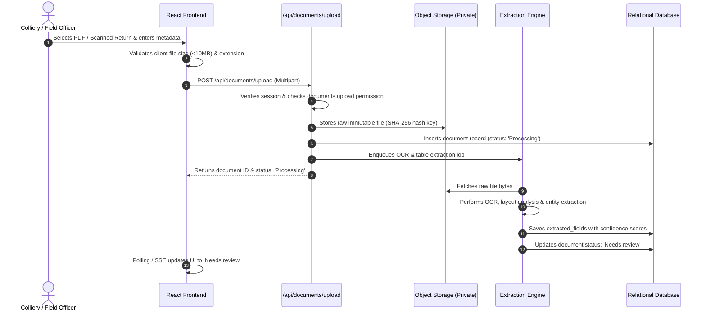
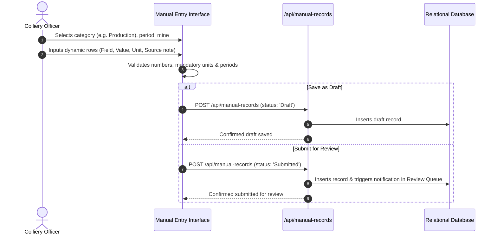
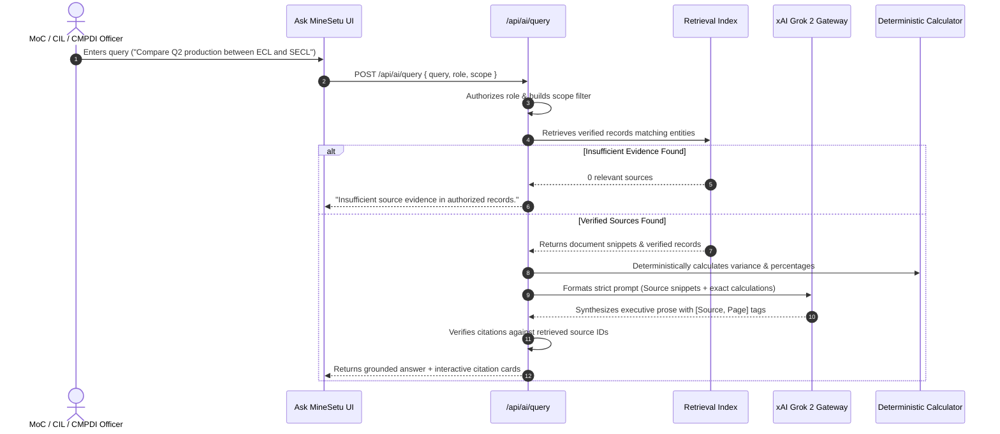

# MineSetu AI — System Architecture Specification

> **STATUS**: APPROVED MASTER ARCHITECTURE & AUDIT BLUEPRINT  
> **LAST UPDATED**: October 2026  
> **TARGET HOSTING**: Vercel (Web & Serverless/Edge) with External Durable Storage  
> **CANONICAL LOCATION**: `docs/architecture.md`

---

## 1. Starting Architecture (Repository Audit Snapshot)

An inspection of the repository codebase conducted in October 2026 establishes the empirical baseline:

```text
Starting State: Client-Only Single-Page Application (SPA)
┌────────────────────────────────────────────────────────────────────────┐
│                        FRONTEND (React 19 / Vite)                      │
│                                                                        │
│  - React 19.2.8, Vite 8.3.0, TypeScript 6.0.2                          │
│  - Lucide React 1.49.0 for iconography                                │
│  - Custom Tokenized Vanilla CSS (frontend/src/styles/)                 │
│  - Client-Side State: AppContext.tsx (useState / in-memory arrays)     │
│  - Mock Data Seed: frontend/src/data/mockMiningData.ts                │
│  - Client-Side Permission Check: frontend/src/lib/rbac.ts             │
└───────────────────────────────────┬────────────────────────────────────┘
                                    │ (Zero Network / HTTP Calls)
                                    ▼
┌────────────────────────────────────────────────────────────────────────┐
│                       BACKEND & SERVICES (EMPTY)                       │
│                                                                        │
│  - backend/functions/.gitkeep (No serverless code implemented)        │
│  - backend/supabase/migrations/.gitkeep (No database schema applied)  │
│  - backend/supabase/seed/.gitkeep (No SQL seed data applied)          │
│  - services/ai-engine/.gitkeep (No microservice implemented)          │
└────────────────────────────────────────────────────────────────────────┘
```

### 1.1 Verified Audit Facts
- **VERIFIED FACT**: The frontend is a fully functional client-side SPA that builds cleanly (`npm --prefix frontend run build` completes in <300ms) with 0 compiler errors.
- **VERIFIED FACT**: The repository contains no active server routes, no running database connection, and no live API clients (searches for `fetch()`, `axios`, or `@supabase/supabase-js` in `frontend/src` return zero network calls).
- **VERIFIED FACT**: The root `package.json` delegates commands to `frontend` and runs unit tests via `node --test tests/unit/rbac.test.mjs` (5 passing tests).
- **VERIFIED FACT**: Current backend directories (`backend/functions`, `backend/supabase`, `services/ai-engine`) exist solely as placeholder directories containing `.gitkeep`.

---

## 2. Target Logical Architecture

The target architecture transitions MineSetu AI from an in-memory client prototype to a robust, modular web application designed for secure Vercel deployment.

```text
┌──────────────────────────────────────────────────────────────────────────────┐
│                            PRESENTATION LAYER (Vercel Edge / CDN)            │
│                                                                              │
│  Landing Page │ Split Login │ 4 Persona Dashboards │ Dual Ingestion (Upload/ │
│  Manual) │ Validation Workbench │ Ask MineSetu │ Reports (.docx/PDF/Excel)   │
└──────────────────────────────────────┬───────────────────────────────────────┘
                                       │ HTTPS (Encrypted JSON / Multipart)
                                       ▼
┌──────────────────────────────────────────────────────────────────────────────┐
│                       API & ROUTE HANDLER LAYER (Vercel Serverless)          │
│                                                                              │
│  /api/auth/*     │ /api/documents/*  │ /api/manual-records/*                 │
│  /api/requests/* │ /api/ai/query     │ /api/reports/*     │ /api/topics      │
└──────────────────┬───────────────────┬───────────────────┬───────────────────┘
                   │                   │                   │
                   ▼                   ▼                   ▼
┌──────────────────────────┐ ┌───────────────────┐ ┌───────────────────────────┐
│ DOMAIN & VALIDATION LAYER│ │ AI GATEWAY SERVICE│ │ DATA ACCESS LAYER         │
│                          │ │                   │ │                           │
│ - Request DTO Validation │ │ - Prompt Builder  │ │ - Typed Repository Layer  │
│ - RBAC Scope Enforcement │ │ - Grok 2 Client   │ │ - Relational Query Client │
│ - Arithmetic Calculator  │ │ - Grounding Check │ │ - Vector Similarity Query │
│ - Audit Event Dispatcher │ │ - Multi-Key Rot.  │ │ - Immutable Storage SDK   │
└──────────────────────────┘ └─────────┬─────────┘ └─────────────┬─────────────┘
                                       │                         │
                                       ▼                         ▼
┌──────────────────────────────────────────────┐ ┌─────────────────────────────┐
│ EXTERNAL AI PROVIDER                         │ │ PERSISTENCE & STORAGE       │
│                                              │ │                             │
│ - xAI Grok 2 Inference API (Server-Side)    │ │ - PostgreSQL Database       │
│ - Offline Fallback Demo Model Engine         │ │ - Object Storage (S3 /      │
│                                              │ │   Supabase Storage Bucket)  │
│                                              │ │ - Append-Only Audit Ledger  │
└──────────────────────────────────────────────┘ └─────────────────────────────┘
```

---

## 3. Component Boundaries & Trust Model

| Boundary | Untrusted Side | Trusted Side | Enforcement Mechanism |
|---|---|---|---|
| **Client ↔ API** | Browser / User Input | Serverless Function | Schema validation (Zod/JSON Schema), JWT verification, role permission checks. |
| **API ↔ Storage** | Incoming File Payload | Object Storage | MIME type sniffing, file signature verification, 10MB size limit, private bucket access. |
| **API ↔ AI Provider** | Generated LLM Text | System Context | Citation extraction verification, anti-hallucination guardrail, numeric calculation override. |
| **API ↔ Database** | Application Request | PostgreSQL Engine | Parameterized queries, Row-Level Security (RLS) policies scoped by organization ID. |

### 3.1 Principle of Server-Side Enforcement
- **Client Guards are UX Only**: Hiding a navigation link or disabling a button in React improves user experience but provides **zero security**.
- **Server-Side Authorization**: Every API route handler must verify the caller's session token and assert that `can(session.user, required_permission)` evaluates to true before performing data reads or mutations.

---

## 4. Route & Navigation Architecture

The application adopts a clean, role-aware route hierarchy:

```text
Public Routes (No Authentication Required)
├── / ......................... Institutional Landing Page (Hero, How it works, Capabilities, Disclaimer)
└── /login .................... Desktop Split-Screen Demo Login & Role Selector

Authenticated Workspace (Wrapped in DashboardLayout)
├── /dashboard ................ Role-Tailored Operational Overview & KPI Summary
├── /ask ...................... "Ask MineSetu" Unified AI Composer & Source-Grounded Workspace
├── /documents ................ Document Archive & Ingestion Queue
│   ├── /documents/upload ..... Dedicated Upload Dropzone (PDF, Scans, Spreadsheets)
│   ├── /documents/manual ..... First-Class Manual Data Entry Interface
│   └── /documents/:id/verify . Human-in-the-Loop Validation Workbench (Side-by-Side Facsimile)
├── /requests ................. Cross-Organization Information Requests & Submissions
├── /review ................... Multi-Stage Submission Review & Correction Queue
├── /reports .................. Multi-Format Report Builder & Draft Archive (.docx, PDF, .xlsx)
├── /topics ................... Topic Intelligence & Interactive Word Cloud
├── /activity ................. Tamper-Evident System Audit Ledger
└── /settings ................. User Profile, Demo Persona Switcher & Preferences
```

---

## 5. End-to-End Data & Execution Flows

### 5.1 Document Upload & Ingestion Flow


### 5.2 Manual Structured Data Entry Flow


### 5.3 Source-Grounded "Ask MineSetu" Query Flow


---

## 6. Vercel Deployment Constraints & Strategy

Deploying MineSetu AI on Vercel imposes distinct architectural boundaries that must be explicitly planned:

| Vercel Constraint | Technical Limit | Architectural Strategy |
|---|---|---|
| **Serverless Execution Timeout** | 10 seconds (Hobby) / 15–60 seconds (Pro) | Synchronous API routes handle quick tasks (<3s). Heavy OCR or multi-page table extraction must be offloaded to an asynchronous external worker or staged pipeline. |
| **Payload Size Limit** | 4.5 MB for Serverless Request Bodies | Direct multi-part uploads exceeding 4.5MB must use **pre-signed direct upload URLs** to object storage (e.g. Supabase Storage / AWS S3), bypassing serverless function execution entirely. |
| **Filesystem Ephemerality** | `/tmp` is temporary and wiped across invocations | **Zero durable local storage**. Never store uploaded documents or generated exports on the serverless filesystem. All files reside in object storage. |
| **Stateless Concurrency** | Each request runs in an isolated container | Application state resides exclusively in the client (optimistic UI) and the database (durable truth). |

### 6.1 External Worker Criteria (When Needed)
An external worker service (e.g., AWS Lambda with custom container, Google Cloud Run, or Celery worker) is required if:
1. Document OCR parsing requires heavy binaries (e.g. Tesseract, Poppler, OpenCV) exceeding Vercel function bundle limits (50MB compressed).
2. Document extraction duration regularly exceeds 15 seconds per document.
3. Complex batch document comparison spans hundreds of historical records simultaneously.

*For the prototype stage, document extraction is performed with lightweight parser libraries or pre-calculated synthetic demonstrations.*

---

## 7. Technology Selection Status

| Component | Selected Technology | Status | Rationale / Alternatives Considered |
|---|---|---|---|
| **Frontend Framework** | React 19 + TypeScript + Vite | **APPROVED** | Fast build times, zero framework bloat, complete control over design tokens. |
| **Iconography** | Lucide React | **APPROVED** | Clean, institutional enterprise icon suite. |
| **Styling** | Tokenized Vanilla CSS | **APPROVED** | Highest fidelity to visual design references without CSS-in-JS overhead or Tailwind coupling. |
| **Hosting & CDN** | Vercel | **APPROVED** | Seamless SPA routing, edge caching, and serverless route scaling. |
| **API Architecture** | Next.js API Routes or Vercel Serverless Functions | **PROPOSAL** | Minimal Node.js/TypeScript serverless endpoints matching frontend stack. |
| **Database** | PostgreSQL (via Supabase or Neon) | **PROPOSAL** | Robust relational model, JSONB support for extracted entities, Row-Level Security. |
| **Object Storage** | Supabase Storage or AWS S3 | **PROPOSAL** | S3-compatible private buckets for immutable raw document storage. |
| **LLM Inference** | xAI Grok 2 API (`grok-2`) | **PROPOSAL** | Advanced reasoning with multi-key fallback; simulated offline engine for demo safety. |
| **OCR Engine** | Tesseract.js / AWS Textract / Cloud Vision | **PROPOSAL** | Pending evaluation of colliery slip handwriting accuracy. |
