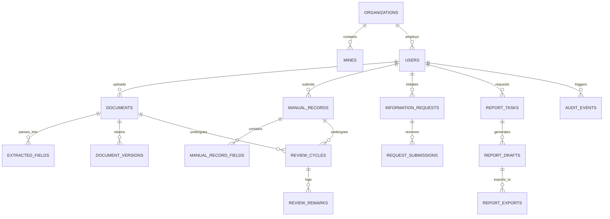

# MineSetu AI — Data Model & Entity Relationship Architecture

> **STATUS**: APPROVED MASTER DATA SPECIFICATION  
> **LAST UPDATED**: October 2026  
> **TARGET PERSISTENCE**: Relational PostgreSQL + Immutable S3/Supabase Storage  
> **CANONICAL LOCATION**: `docs/data-model.md`

---

## 1. Existing Model vs Proposed Model

To maintain strict architectural honesty, this document distinguishes between the **current client-side prototype types** and the **proposed backend relational schema**.

### 1.1 Existing Client Model (`frontend/src/types/index.ts`)
- Defined as TypeScript interfaces in `frontend/src/types/index.ts`.
- Manages in-memory state:
  - `User`: In-memory demo persona identity.
  - `DocumentRecord`: In-memory representation of returns with nested `ExtractedField[]`.
  - `ParliamentaryQuery`: Legislative drafting entity (now superseded by the broader `InformationRequest` entity).
  - `TopicCluster`: Term weights and urgency scores.
  - `AuditEvent`: In-memory append-only audit entries.
- **Limitation**: Volatile; resets to `mockMiningData.ts` on page refresh unless stored in `localStorage`.

---

## 2. Proposed Implementation-Neutral Domain Model

The proposed persistence schema establishes clear relational boundaries, foreign key constraints, and multi-tenant data isolation:

---

## 3. Detailed Entity Schemas

### 3.1 Organizations & Mines (`organizations`, `mines`)
- **`organizations`**:
  - `id`: UUID (Primary Key).
  - `code`: VARCHAR(10) UNIQUE (e.g. `'MoC'`, `'CIL'`, `'ECL'`, `'SECL'`, `'CMPDI'`).
  - `name`: TEXT (e.g. `'Eastern Coalfields Limited'`).
  - `tier`: ENUM (`'ministry'`, `'apex_hq'`, `'subsidiary'`, `'institute'`).
  - `headquarters_location`: TEXT (e.g. `'Sanctoria, West Bengal'`).
  - `annual_target_mt`: NUMERIC(10, 2).
- **`mines`**:
  - `id`: UUID (Primary Key).
  - `organization_id`: UUID (Foreign Key -> `organizations.id`).
  - `name`: TEXT (e.g. `'Rajmahal Open Cast Project'`).
  - `colliery_type`: ENUM (`'open_cast'`, `'underground'`, `'mixed'`).
  - `area_code`: TEXT (e.g. `'Rajmahal Area'`).

### 3.2 Users & Demo Personas (`users`)
- **`users`**:
  - `id`: UUID (Primary Key).
  - `organization_id`: UUID (Foreign Key -> `organizations.id`).
  - `mine_id`: UUID (Nullable, Foreign Key -> `mines.id`).
  - `email`: TEXT UNIQUE.
  - `full_name`: TEXT.
  - `role`: ENUM (`'ministry_coal'`, `'cil_hq'`, `'cmpdi'`, `'subsidiary_officer'`).
  - `role_label`: TEXT (e.g. `'Ministry Executive'`).
  - `is_demo`: BOOLEAN DEFAULT true.
  - `created_at`: TIMESTAMPTZ DEFAULT now().

### 3.3 Documents & Versions (`documents`, `document_versions`)
- **`documents`**:
  - `id`: UUID (Primary Key).
  - `organization_id`: UUID (Foreign Key -> `organizations.id`).
  - `mine_id`: UUID (Nullable, Foreign Key -> `mines.id`).
  - `uploaded_by_user_id`: UUID (Foreign Key -> `users.id`).
  - `title`: TEXT.
  - `category`: ENUM (`'production'`, `'overburden'`, `'geological'`, `'safety'`, `'despatch'`).
  - `reporting_period`: TEXT (e.g. `'August 2026'`).
  - `file_url`: TEXT (Storage path in private bucket).
  - `file_name`: TEXT.
  - `mime_type`: TEXT.
  - `file_size_bytes`: BIGINT.
  - `sha256_hash`: VARCHAR(64) NOT NULL.
  - `page_count`: INTEGER DEFAULT 1.
  - `status`: ENUM (`'draft'`, `'processing'`, `'needs_review'`, `'partially_extracted'`, `'ready_to_search'`, `'failed'`).
  - `median_confidence`: NUMERIC(5, 2).
  - `extracted_summary`: TEXT.
  - `is_demo`: BOOLEAN DEFAULT true.
  - `created_at`: TIMESTAMPTZ DEFAULT now().
- **`document_versions`**:
  - `id`: UUID (Primary Key).
  - `document_id`: UUID (Foreign Key -> `documents.id` ON DELETE CASCADE).
  - `version_number`: INTEGER.
  - `file_url`: TEXT.
  - `created_at`: TIMESTAMPTZ DEFAULT now().

### 3.4 Extracted Fields & Coordinates (`extracted_fields`)
- **`extracted_fields`**:
  - `id`: UUID (Primary Key).
  - `document_id`: UUID (Foreign Key -> `documents.id` ON DELETE CASCADE).
  - `field_name`: TEXT (e.g. `'raw_coal_production'`, `'ob_removal'`, `'ash_content'`).
  - `label`: TEXT (Human readable label, e.g. `'Raw Coal Production'`).
  - `extracted_value`: TEXT.
  - `verified_value`: TEXT (Nullable, edited by human reviewer).
  - `unit`: VARCHAR(20) (e.g. `'Tonnes'`, `'m³'`, `'%'`).
  - `confidence_score`: NUMERIC(5, 2).
  - `page_number`: INTEGER.
  - `bounding_box`: JSONB (Coordinates `[x1, y1, x2, y2]`).
  - `status`: ENUM (`'auto_extracted'`, `'verified'`, `'flagged_error'`).
  - `verified_by_user_id`: UUID (Nullable, Foreign Key -> `users.id`).
  - `verification_notes`: TEXT.
  - `created_at`: TIMESTAMPTZ DEFAULT now().

### 3.5 First-Class Manual Structured Records (`manual_records`, `manual_record_fields`)
- **`manual_records`**:
  - `id`: UUID (Primary Key).
  - `organization_id`: UUID (Foreign Key -> `organizations.id`).
  - `mine_id`: UUID (Foreign Key -> `mines.id`).
  - `author_user_id`: UUID (Foreign Key -> `users.id`).
  - `category`: ENUM (`'production'`, `'overburden'`, `'geological'`, `'safety'`, `'despatch'`).
  - `reporting_period`: TEXT.
  - `source_date`: DATE.
  - `status`: ENUM (`'draft'`, `'submitted'`, `'under_review'`, `'accepted'`, `'returned'`).
  - `created_at`: TIMESTAMPTZ DEFAULT now().
- **`manual_record_fields`**:
  - `id`: UUID (Primary Key).
  - `manual_record_id`: UUID (Foreign Key -> `manual_records.id` ON DELETE CASCADE).
  - `field_name`: TEXT.
  - `value`: NUMERIC(14, 3).
  - `unit`: VARCHAR(20).
  - `source_explanation`: TEXT (Defaults to `'Source not provided'` if blank).

### 3.6 Cross-Organization Requests (`information_requests`, `request_submissions`)
- **`information_requests`**:
  - `id`: UUID (Primary Key).
  - `initiator_user_id`: UUID (Foreign Key -> `users.id`).
  - `initiator_organization_id`: UUID (Foreign Key -> `organizations.id`).
  - `target_organization_id`: UUID (Foreign Key -> `organizations.id`).
  - `subject`: TEXT.
  - `reporting_period`: TEXT.
  - `requested_data_points`: JSONB (Array of string field names).
  - `due_date`: TIMESTAMPTZ.
  - `status`: ENUM (`'draft'`, `'awaiting_response'`, `'partially_answered'`, `'submitted'`, `'clarification_required'`, `'completed'`).
  - `created_at`: TIMESTAMPTZ DEFAULT now().
- **`request_submissions`**:
  - `id`: UUID (Primary Key).
  - `request_id`: UUID (Foreign Key -> `information_requests.id`).
  - `submitted_by_user_id`: UUID (Foreign Key -> `users.id`).
  - `response_text`: TEXT.
  - `attached_document_ids`: JSONB (Array of document UUIDs).
  - `submitted_at`: TIMESTAMPTZ DEFAULT now().

### 3.7 Review Cycles & Remarks (`review_cycles`, `review_remarks`)
- **`review_cycles`**:
  - `id`: UUID (Primary Key).
  - `target_entity_type`: ENUM (`'document'`, `'manual_record'`, `'request_submission'`).
  - `target_entity_id`: UUID.
  - `current_stage`: ENUM (`'field_submission'`, `'cmpdi_technical_verification'`, `'cil_hq_consolidation'`, `'ministry_review'`).
  - `status`: ENUM (`'under_review'`, `'accepted'`, `'returned_for_correction'`).
  - `opened_at`: TIMESTAMPTZ DEFAULT now().
- **`review_remarks`**:
  - `id`: UUID (Primary Key).
  - `review_cycle_id`: UUID (Foreign Key -> `review_cycles.id`).
  - `reviewer_user_id`: UUID (Foreign Key -> `users.id`).
  - `remark_text`: TEXT.
  - `action`: ENUM (`'accept'`, `'return_for_correction'`, `'request_clarification'`).
  - `created_at`: TIMESTAMPTZ DEFAULT now().

### 3.8 Reports & Exports (`report_tasks`, `report_drafts`, `report_exports`)
- **`report_tasks`**:
  - `id`: UUID (Primary Key).
  - `requested_by_user_id`: UUID (Foreign Key -> `users.id`).
  - `report_type`: TEXT.
  - `reporting_period`: TEXT.
  - `scope_filter`: JSONB.
  - `comparison_basis`: TEXT.
  - `selected_source_ids`: JSONB.
  - `status`: ENUM (`'queued'`, `'compiling'`, `'ready'`, `'failed'`).
  - `created_at`: TIMESTAMPTZ DEFAULT now().
- **`report_drafts`**:
  - `id`: UUID (Primary Key).
  - `task_id`: UUID (Foreign Key -> `report_tasks.id`).
  - `title`: TEXT.
  - `executive_summary`: TEXT.
  - `metrics_table_data`: JSONB.
  - `citations`: JSONB.
  - `draft_status`: ENUM (`'draft'`, `'reviewed'`, `'final'`).
- **`report_exports`**:
  - `id`: UUID (Primary Key).
  - `draft_id`: UUID (Foreign Key -> `report_drafts.id`).
  - `format`: ENUM (`'pdf'`, `'docx'`, `'xlsx'`).
  - `file_url`: TEXT.
  - `file_size_bytes`: BIGINT.
  - `exported_at`: TIMESTAMPTZ DEFAULT now().

### 3.9 Audit Trail (`audit_events`)
- **`audit_events`**:
  - `id`: UUID (Primary Key).
  - `timestamp`: TIMESTAMPTZ DEFAULT now().
  - `actor_user_id`: UUID (Foreign Key -> `users.id`).
  - `actor_name`: TEXT.
  - `actor_role`: TEXT.
  - `action`: TEXT (e.g. `'documents.upload'`, `'fields.verify'`, `'records.submit'`).
  - `entity_type`: TEXT.
  - `entity_id`: TEXT.
  - `result`: ENUM (`'success'`, `'failure'`, `'denied'`).
  - `metadata`: JSONB.
  - **Constraint**: Append-only table. `UPDATE` and `DELETE` database privileges disabled.

---

## 4. Multi-Tenant Access Scoping Rules

| Entity | `subsidiary_officer` Scope | `cmpdi` Scope | `cil_hq` Scope | `ministry_coal` Scope |
|---|---|---|---|---|
| `documents` | Owned Mine/Subsidiary only | Multi-subsidiary technical | All 8 CIL subsidiaries | All approved national records |
| `manual_records`| Owned Mine only | Multi-subsidiary technical | All 8 CIL subsidiaries | All approved national records |
| `extracted_fields`| Owned documents | Full verification write | Read all / Flag variances | Read approved |
| `audit_events` | Own actions | Technical queue actions | Enterprise actions | National actions |
